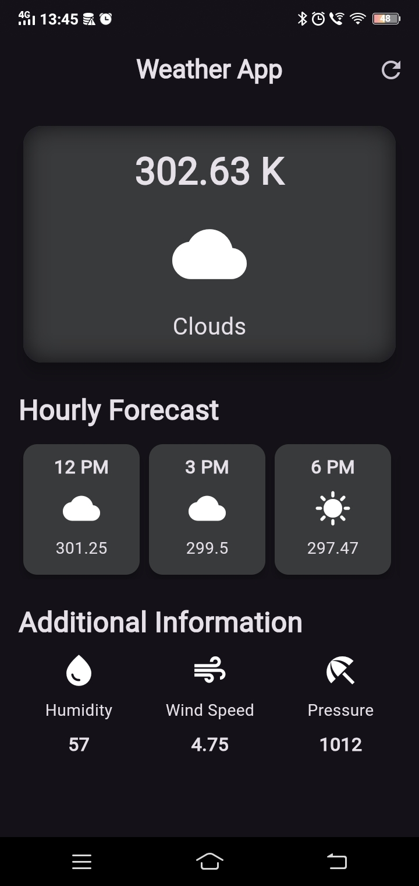

# Weather App

A simple and modern Weather Application built using Flutter. This app provides real-time weather information such as temperature, condition, humidity, and wind speed for a selected city/location with a clean and user-friendly interface.

## Features

✅ Real-time weather updates

✅ Displays temperature and weather condition

✅ Shows humidity and wind speed

✅ Clean UI with Flutter Material Design

✅ Responsive design for different screen sizes

## Tech Stack

Flutter

Dart

Weather API (OpenWeatherMap / any weather API you used)

HTTP package for API integration

## Installation

Clone the repository

git clone https://github.com/k-saravanan-2006/weather_app.git

Navigate into the folder

cd weather_app

Install dependencies

flutter pub get

Run the app

flutter run

## API Reference

#### Get all items

This app uses a Weather API key.

Steps:

Create an account on OpenWeatherMap (or any weather provider)

Generate your API key

Add it inside your service file:

Example (weather_service.dart):

const String apiKey = "YOUR_API_KEY";

Takes two numbers and returns the sum.

## Screenshots

## Developed By

K Saravanan